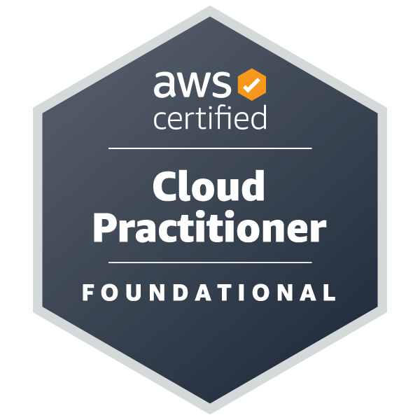
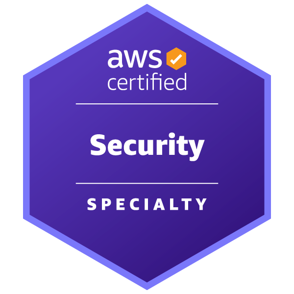
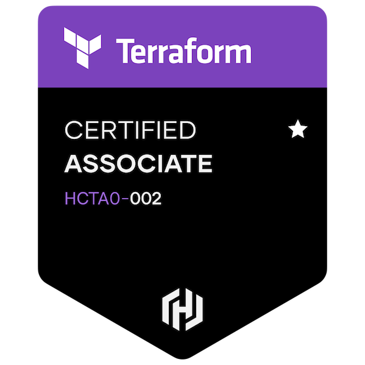
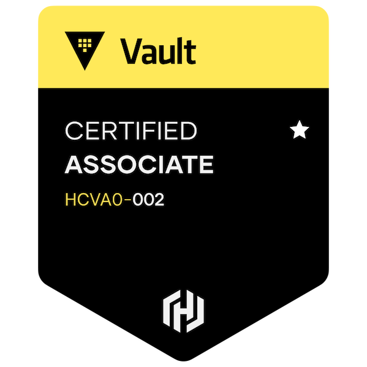

# Hi, I'm Jose 👋

  

 
 

I'm a ***Security Expert*** specializing in the architecture and development of Cloud, Compliance, Identity, Security Management, and Infrastructure solutions.

I have experience in:

- Cryptography
- Hardware Security Modules (HSMs)
- Tokenization
- Linux, Unix, and Windows operating systems
- Web application and microservices architecture

Spoken and written languages:

- Portuguese
- English
- Spanish

Favorite programming languages:

- C
- Javascript (Node.js)
- Python
- Ruby
- Shell 

Currently, I work at [Itau Unibanco S/A](https://www.itau.com.br).
 

## Connect with me
 
You can reach me out on the following platforms.
 
 

  <a href="https://www.instagram.com/jribeironetto/" target="_blank" style="margin-right: 10px">
    <picture>
      <source media="(prefers-color-scheme: dark)" srcset="https://res.cloudinary.com/jnetto/image/upload/v1654178152/mineiro/assets/images/social/social-instagram.png">
      <source media="(prefers-color-scheme: light)" srcset="https://res.cloudinary.com/jnetto/image/upload/v1654178152/mineiro/assets/images/social/social-instagram-stone.png">
      
    </picture>
  </a>
  <a href="https://www.linkedin.com/in/jribeironetto/" target="_blank" style="margin-right: 10px">
    <picture>
      <source media="(prefers-color-scheme: dark)" srcset="https://res.cloudinary.com/jnetto/image/upload/v1654178152/mineiro/assets/images/social/social-linkedin.png">
      <source media="(prefers-color-scheme: light)" srcset="https://res.cloudinary.com/jnetto/image/upload/v1654178152/mineiro/assets/images/social/social-linkedin-stone.png">
      
    </picture>
  </a>
  <a href="https://twitter.com/jribeironetto" target="_blank">
    <picture>
      <source media="(prefers-color-scheme: dark)" srcset="https://res.cloudinary.com/jnetto/image/upload/v1654178152/mineiro/assets/images/social/social-twitter.png">
      <source media="(prefers-color-scheme: light)" srcset="https://res.cloudinary.com/jnetto/image/upload/v1654178152/mineiro/assets/images/social/social-twitter-stone.png">
      
    </picture>
  </a>

## Certifications
 
Here's a list of some badges recently acquired.
 
 

  
  
  
  
  

